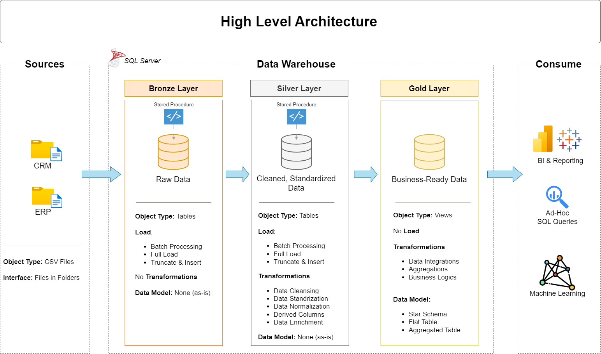
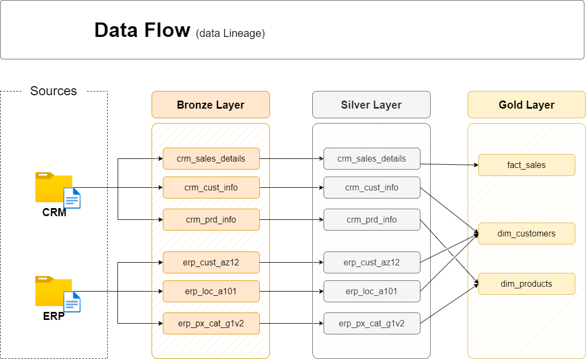
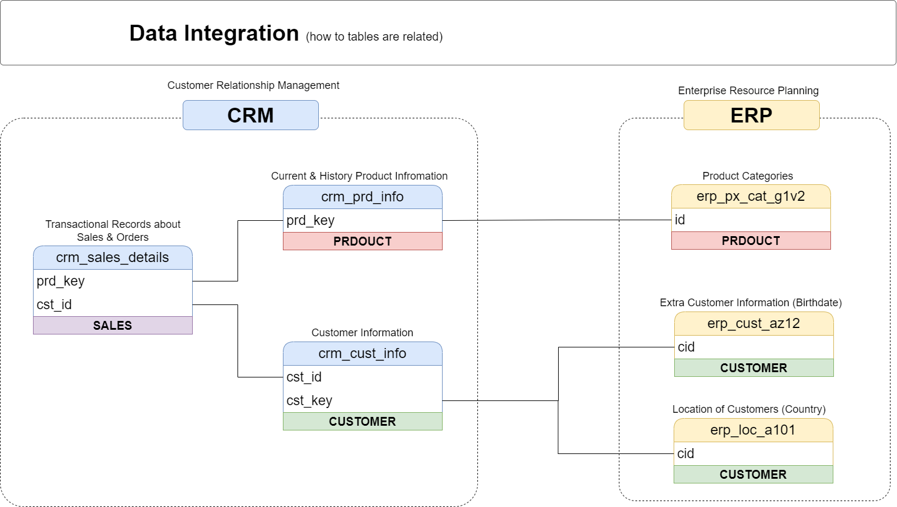
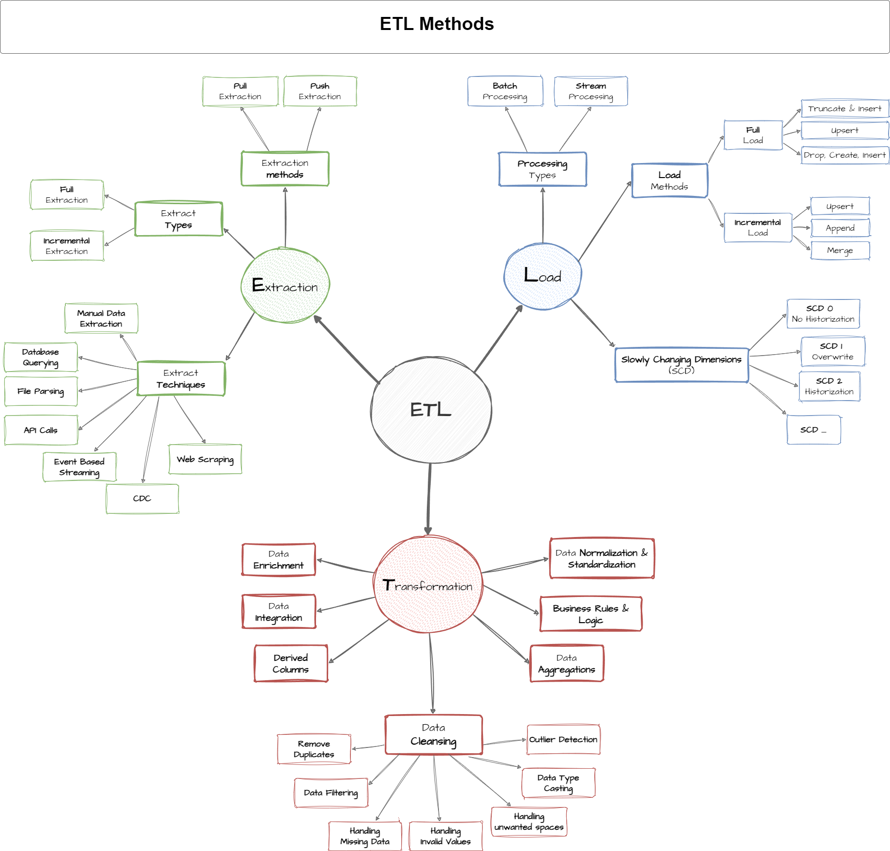

# Data Warehouse and Analytics Project

Welcome to the **Data Warehouse and Analytics Project** repository! 🚀  
This project demonstrates a comprehensive data warehousing and analytics solution, from building a data warehouse to generating actionable insights. Designed as a portfolio project, it highlights industry best practices in data engineering and analytics.

---
## 📖 Project Overview

This project involves:

1. **Data Architecture**: Designing a Modern Data Warehouse Using Medallion Architecture **Bronze**, **Silver**, and **Gold** layers.
2. **ETL Pipelines**: Extracting, transforming, and loading data from source systems into the warehouse.
3. **Data Modeling**: Developing fact and dimension tables optimized for analytical queries.
4. **Analytics & Reporting**: Creating SQL-based reports and dashboards for actionable insights.

---
## 🚀 Project Requirements

### Building the Data Warehouse (Data Engineering)

#### Objective
Develop a modern data warehouse using SQL Server to consolidate sales data, enabling analytical reporting and informed decision-making.

#### Specifications
- **Data Sources**: Import data from two source systems (ERP and CRM) provided as CSV files.
- **Data Quality**: Cleanse and resolve data quality issues prior to analysis.
- **Integration**: Combine both sources into a single, user-friendly data model designed for analytical queries.
- **Scope**: Focus on the latest dataset only; historization of data is not required.
- **Documentation**: Provide clear documentation of the data model to support both business stakeholders and analytics teams.

---
## 🛠️ Important Links & Tools:

Everything is for Free!
- **[Datasets](datasets/):** Access to the project dataset (csv files).
- **[SQL Server Express](https://www.microsoft.com/en-us/sql-server/sql-server-downloads):** Lightweight server for hosting your SQL database.
- **[SQL Server Management Studio (SSMS)](https://learn.microsoft.com/en-us/sql/ssms/download-sql-server-management-studio-ssms?view=sql-server-ver16):** GUI for managing and interacting with databases.
- **[Git Repository](https://github.com/):** Set up a GitHub account and repository to manage, version, and collaborate on your code efficiently.
- **[DrawIO](https://www.drawio.com/):** Design data architecture, models, flows, and diagrams.
- **[Notion](https://www.notion.com/templates/sql-data-warehouse-project):** Get the Project Template from Notion
- **[Notion Project Steps](https://thankful-pangolin-2ca.notion.site/SQL-Data-Warehouse-Project-16ed041640ef80489667cfe2f380b269?pvs=4):** Access to All Project Phases and Tasks.
---

## 🏗️ Data Architecture

The data architecture for this project follows Medallion Architecture **Bronze**, **Silver**, and **Gold** layers:

📌 **Architecture Diagram**


1. **Bronze Layer**: Stores raw data as-is from the source systems. Data is ingested from CSV Files into SQL Server Database.
2. **Silver Layer**: This layer includes data cleansing, standardization, and normalization processes to prepare data for analysis.
3. **Gold Layer**: Houses business-ready data modeled into a star schema required for reporting and analytics.

---
## 🧱 Data Layers Explained

📄 **Detailed Layer Explanation**  
👉 [📄 View PDF](docs/data_layers.pdf)

### 🟤 Bronze Layer
- Raw data from **CRM & ERP CSV files**
- No transformations
- Full load (Truncate & Insert)
- Used for **traceability & auditing**

### ⚪ Silver Layer
- Data cleansing & standardization
- Deduplication and normalization
- Derived columns and enrichment
- Prepares data for analytics

### 🟡 Gold Layer
- Business logic & aggregations
- Star schema & analytical views
- Optimized for BI and reporting
- No physical load (views only)
---
## 🔄 Data Flow (Data Lineage)

Illustrates how data flows from **source systems → bronze → silver → gold**.

📌 **Data Flow Diagram**  

👉 

### Flow Summary
1. CRM & ERP CSV files ingested into Bronze layer
2. Data cleaned and standardized in Silver layer
3. Integrated into dimensions and facts in Gold layer

---
## 🔗 Data Integration (CRM & ERP)

Explains how **business entities are integrated across systems**.

📌 **Data Integration Diagram**  
👉 

### Key Integrations
- **Customers** → CRM + ERP (demographics, location)
- **Products** → CRM + ERP (categories, maintenance)
- **Sales** → CRM transactions enriched with master data
---
## 🔧 ETL Methodology

📌 **ETL Methods Diagram**  
👉 

### Extraction
- Full & incremental extraction
- File parsing (CSV)
- Database querying

### Transformation
- Data cleansing
- Normalization & standardization
- Business rules
- Aggregations
- Derived columns

### Load
- Full load (Truncate & Insert)
- Incremental load
- Slowly Changing Dimensions (SCD 0, 1, 2)
  
---
## 📘 Data Catalog

Provides detailed metadata for **Gold Layer tables and columns**.

📄 **Data Catalog Document**  
👉 [📄 Open catalog](docs/data_catalog.md)

---
## 📐 Naming Conventions

Ensures consistency across schemas, tables, and columns.

📄 **Naming Conventions Guide**  
👉 [📄 Open conversion rule](docs/naming_conversion.md)
---

## 📂 Repository Structure
```
data-warehouse-project/
│
├── datasets/                           # Raw datasets used for the project (ERP and CRM data)
│
├── docs/                               # Project documentation and architecture details
│   ├── etl.drawio                      # Draw.io file shows all different techniquies and methods of ETL
│   ├── data_architecture.drawio        # Draw.io file shows the project's architecture
│   ├── data_catalog.md                 # Catalog of datasets, including field descriptions and metadata
│   ├── data_flow.drawio                # Draw.io file for the data flow diagram
│   ├── data_models.drawio              # Draw.io file for data models (star schema)
│   ├── naming-conventions.md           # Consistent naming guidelines for tables, columns, and files
│
├── scripts/                            # SQL scripts for ETL and transformations
│   ├── bronze/                         # Scripts for extracting and loading raw data
│   ├── silver/                         # Scripts for cleaning and transforming data
│   ├── gold/                           # Scripts for creating analytical models
│
├── tests/                              # Test scripts and quality files
│
├── README.md                           # Project overview and instructions
├── LICENSE                             # License information for the repository
├── .gitignore                          # Files and directories to be ignored by Git
└── requirements.txt                    # Dependencies and requirements for the project
```
---
## 📊 Analytics & Consumption

The Gold layer supports:
- 📈 BI dashboards (Power BI / Tableau)
- 🔍 Ad-hoc SQL queries
- 🤖 Machine learning use cases
---

## 🛡️ License

This project is licensed under the **MIT License**.  
Free to use, modify, and distribute with attribution.

## 🌟 About Me

**Azimuddin**  
SQL | Data Warehousing | Analytics  | Data Engineer  

